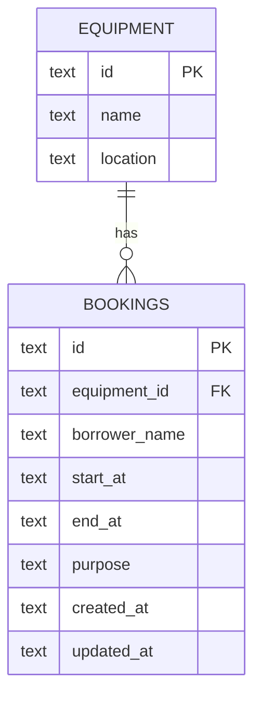

# API Contract

Base URL: `http://localhost:8787/api` locally, or the deployed Cloudflare Worker URL followed by `/api`.

## Assumptions

- Equipment is managed as seeded reference data; this lab exposes read-only equipment listing.
- A booking uses an ISO-8601 timestamp with timezone, such as `2026-10-20T09:00:00.000Z`.
- Adjacent bookings are allowed: a booking ending at 11:00 does not overlap one starting at 11:00.
- Authentication is outside this local lab scope. Production would require authentication and authorization.

## Equipment

`GET /equipment` returns `200` and an array:

```json
[
  { "id": "eq-1", "name": "Projector A", "location": "Building 1" },
  { "id": "eq-2", "name": "Camera Kit A", "location": "Media Room" }
]
```

## Bookings

| Method | Path | Success | Meaning |
| --- | --- | ---: | --- |
| GET | `/bookings` | 200 | List bookings ordered by start time |
| GET | `/bookings/:id` | 200 | Return one booking |
| POST | `/bookings` | 201 | Create a booking |
| PATCH | `/bookings/:id` | 200 | Update one or more fields |
| DELETE | `/bookings/:id` | 204 | Delete a booking |

Create and update fields:

```json
{
  "equipmentId": "eq-1",
  "borrowerName": "Somchai Jaidee",
  "startAt": "2026-10-20T09:00:00.000Z",
  "endAt": "2026-10-20T11:00:00.000Z",
  "purpose": "Class presentation"
}
```

Booking responses include `id`, `equipmentId`, `borrowerName`, `startAt`, `endAt`, and `purpose`, plus audit timestamps.

## Validation and errors

Every error is JSON with the required shape `{ "error": "..." }`:

- `400 Bad Request`: missing/unknown fields, invalid ID, unknown `equipmentId`, invalid timestamps, or `startAt >= endAt`.
- `404 Not Found`: the booking or route does not exist.
- `409 Conflict`: the same equipment already has a booking where `newStart < existingEnd AND newEnd > existingStart`.
- `500 Internal Server Error`: unexpected server failure without exposing stack traces.

## Data model / ERD



The foreign key ensures each booking points to existing equipment. The application performs the overlap check before both insert and update.